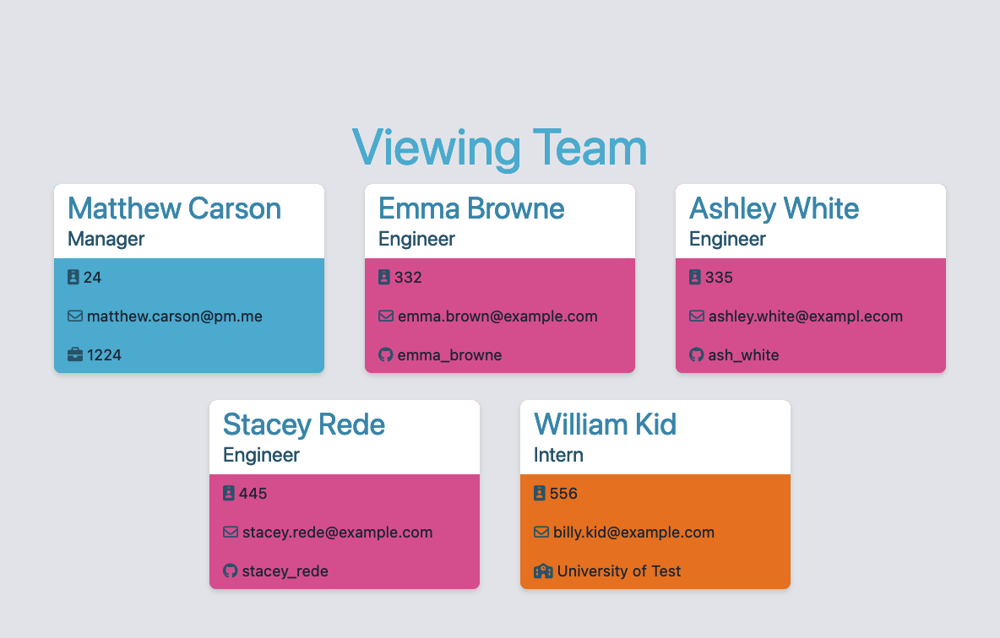

# Team Profile Generator Generator

## Table of Contents
- [Description](#Description)
- [License](#License)
- [Installation](#Installation)
- [Test](#Test)
- [Questions](#Questions)

## Description
A simple and easy-to-use package to create a profile page for a engineering team.

- Choose between different types of employees (Engineers and Interns).
- Input employee's name, id, e-mail, github username, and school.



<iframe width="560" height="315" src="https://www.youtube-nocookie.com/embed/jaGsyA1g2Nc" title="YouTube video player" frameborder="0" allow="accelerometer; autoplay; clipboard-write; encrypted-media; gyroscope; picture-in-picture" allowfullscreen></iframe>

## License

MIT License
  
Copyright (c) 2022

Permission is hereby granted, free of charge, to any person obtaining a copy
of this software and associated documentation files (the "Software"), to deal
in the Software without restriction, including without limitation the rights
to use, copy, modify, merge, publish, distribute, sublicense, and/or sell
copies of the Software, and to permit persons to whom the Software is
furnished to do so, subject to the following conditions:

The above copyright notice and this permission notice shall be included in all
copies or substantial portions of the Software.

THE SOFTWARE IS PROVIDED "AS IS", WITHOUT WARRANTY OF ANY KIND, EXPRESS OR
IMPLIED, INCLUDING BUT NOT LIMITED TO THE WARRANTIES OF MERCHANTABILITY,
FITNESS FOR A PARTICULAR PURPOSE AND NONINFRINGEMENT. IN NO EVENT SHALL THE
AUTHORS OR COPYRIGHT HOLDERS BE LIABLE FOR ANY CLAIM, DAMAGES OR OTHER
LIABILITY, WHETHER IN AN ACTION OF CONTRACT, TORT OR OTHERWISE, ARISING FROM,
OUT OF OR IN CONNECTION WITH THE SOFTWARE OR THE USE OR OTHER DEALINGS IN THE
SOFTWARE.
  
## Installation
```npm install```
## Test
```npm run test```
## Questions
Have additional questions? I can be reached at [Github](https://github.com/mcarson24) or you can e-mail me at matthew.carson@pm.me.

